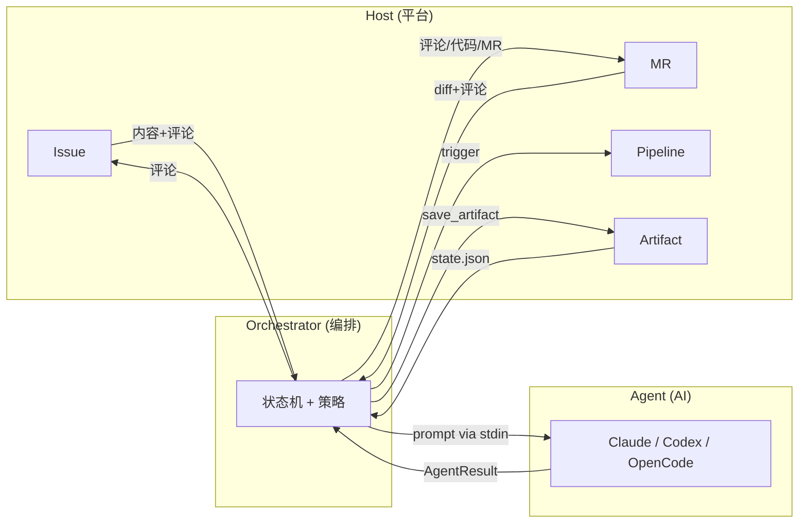
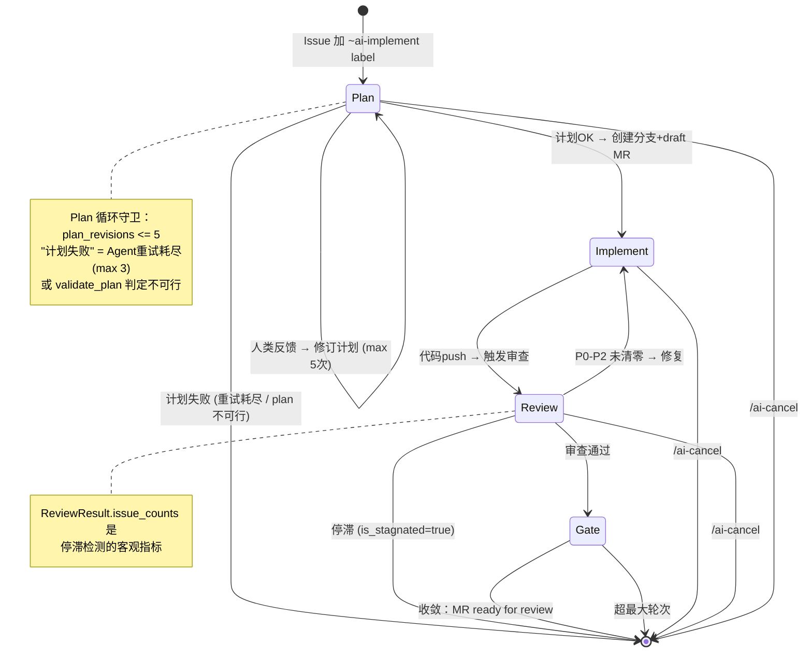
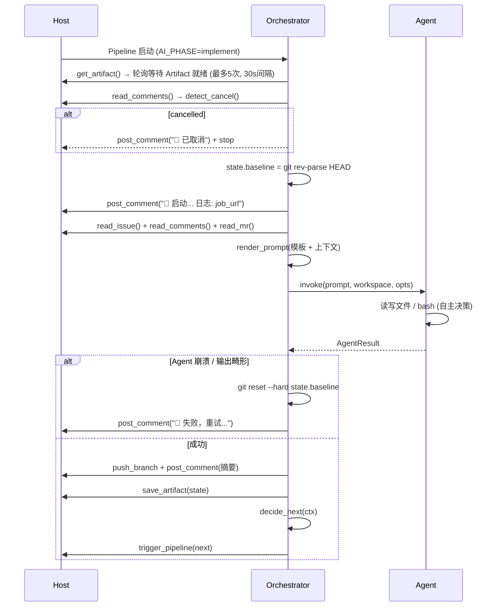
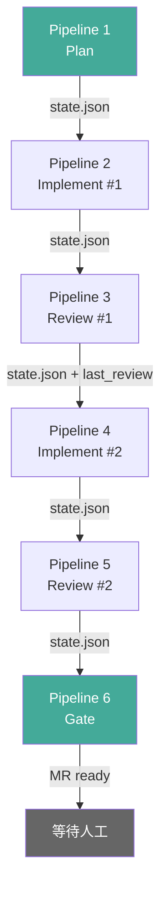
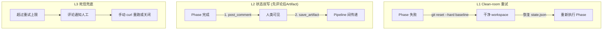

# GitLab AI DevOps Component — 抽象设计

> 一句话：GitLab CI Component，Issue 到 Merge 全程 AI 驱动，`include: component` 即接入。

## 1. 核心抽象：Trait 分离

系统的所有复杂度归结为三个 trait 的交互。
Host 是**平台能力**（GitLab 提供），Agent 是**智能能力**（AI CLI 提供），
Orchestrator 是**编排逻辑**（组合 Host + Agent，驱动状态机）。
三者通过数据流耦合，不共享状态。



### 1.1 trait Host — 纯平台能力，不含策略

Host 只暴露平台原语，不包含任何业务判断（如"什么是取消"属于策略，归 Orchestrator）。

```
trait Host {
  // ── 会话通道 ──
  post_comment(target : Target, body : String) -> CommentId
  update_comment(target : Target, comment_id : CommentId, body : String)
  read_comments(target : Target, since : Option[Timestamp]) -> Array[Comment]
  read_issue(iid : Int) -> Issue
  read_mr(iid : Int) -> MR

  // ── 代码操作 ──
  create_branch(name : String, ref : String)              // 已存在则跳过
  push_branch(name : String)                               // git push --force-with-lease
  create_mr(src : String, dst : String, draft : Bool) -> MR
  find_mr_by_branch(branch : String) -> Option[MR]         // 查询分支是否已有 MR
  merge_mr(iid : Int) -> Bool
  get_diff(base : String, head : String) -> String

  // ── 执行环境 ──
  trigger_pipeline(phase : Phase, vars : Map[String, String]) -> PipelineInfo
  get_pipeline_status(pipeline_id : Int) -> PipelineStatus   // pending/running/success/failed
  get_artifact(job_id : String) -> State
  save_artifact(state : State)
  job_url() -> String
}

type Target = Issue(Int) | MR(Int)

type Comment {
  id : Int
  author : String
  body : String
  is_bot : Bool
  timestamp : String
}

type PipelineStatus = Pending | Running | Success | Failed | Canceled

type PipelineInfo {
  id : Int
  status : PipelineStatus
  web_url : String
}
```

### 1.2 trait Agent — AI 能力

```
trait Agent {
  invoke(prompt : String, workspace : Path, opts : AgentOpts) -> AgentResult
}

type AgentOpts {
  max_turns : Int
  system_prompt : String
  output_format : Text | Json | StreamJson
  full_auto : Bool
}

type AgentResult {
  output : String            // Agent 的文本输出
  exit_code : Int
  workspace_dirty : Bool     // Agent 是否改了文件
  transcript_path : Path     // 完整对话记录
}
```

### 1.3 trait Orchestrator — 编排 + 策略

Orchestrator 持有所有业务策略：取消检测、反馈提取、收敛判断、停滞检测。

```
trait Orchestrator {
  // ── Phase 执行 ──
  run_plan(host : Host, agent : Agent, ctx : Context) -> PlanResult
  run_implement(host : Host, agent : Agent, ctx : Context) -> ImplResult
  run_review(host : Host, agent : Agent, ctx : Context) -> ReviewResult
  run_gate(host : Host, agent : Agent, ctx : Context) -> GateDecision

  // ── 策略 ──
  detect_cancel(comments : Array[Comment]) -> Bool
  detect_human_feedback(comments : Array[Comment]) -> Option[String]
  decide_next(ctx : Context) -> NextAction
}

type PlanResult {
  plan : String
  branch : String
  mr_iid : Int
}

type ImplResult {
  summary : String
  files_changed : Array[String]
  baseline_commit : String    // Agent 执行前的 HEAD commit
  head_commit : String        // Agent 执行后的 HEAD commit
}

type ReviewResult {
  verdict : Approve | RequestChanges
  issues : Array[ReviewIssue]
  issue_counts : { P0 : Int, P1 : Int, P2 : Int, P3 : Int }
}

type ReviewIssue {
  severity : P0 | P1 | P2 | P3
  file : String
  line : Option[Int]
  description : String
  suggestion : String
}

type GateDecision {
  action : MarkReady | Stagnated | Exceeded
  // MarkReady: MR 去掉 draft，加 label ~ai-ready，等人工 review
  // Stagnated: 评论通知人工，Agent 陷入循环
  // Exceeded: iteration >= max_iterations，评论通知
  message : String
}

type NextAction
  | Trigger(Phase, Int)
  | Done
  | Stagnated
  | Cancelled
  | Failed(String)           // Phase 执行失败，记录原因

type Phase = Plan | Implement | Review | Gate
```

## 2. Phase 状态机

每个 Pipeline 运行一个 Phase（一个 Job），Phase 之间通过 `host.trigger_pipeline()` 链式触发。



### 单次 Phase 的执行模型



关键约束：
- **编排层不碰代码逻辑** — 只做 git add/commit/push，不修改文件内容
- **Agent 不碰平台 API** — Agent 只操作本地文件系统
- **每轮一个 Agent** — 一个 Job 里只调用一次 Agent
- **baseline commit** — Phase 开始时记录 HEAD，重入时先 reset 回 baseline

## 3. 状态模型

跨 Pipeline 的状态全部存在 `state.json`，通过 Artifact 传递。

```
type State {
  issue_iid      : Int
  mr_iid         : Int
  branch         : String
  iteration      : Int                 // Review→Implement 时自增；一次 Implement+Review 算一轮
  max_iterations : Int                 // Implement↔Review 循环上限
  plan_revisions : Int                 // Plan→Plan 计数，上限 5
  phase          : Phase
  cancelled      : Bool               // 取消标志，任何 Phase 重入时先检查
  baseline_commit : String            // 当前 Phase 开始前的 HEAD commit
  agents         : { planner : String, implementer : String, reviewer : String }
  plan           : Option[String]
  last_review    : Option[ReviewResult]
  history        : Array[RoundRecord]  // 保留最近 10 条，截断旧记录
}

type RoundRecord {
  iteration     : Int
  phase         : Phase
  agent         : String
  summary       : String
  files_changed : Array[String]
  issue_counts  : { P0 : Int, P1 : Int, P2 : Int, P3 : Int }
  job_url       : String
  timestamp     : String
}
```

### 停滞检测

**在 Review 阶段执行**（非 Gate）。Review→Implement 决策前检查停滞：
如果停滞，不走 Implement，直接转 Gate(Stagnated) 通知人工。

```
// 在 Review Phase 结束时调用
decide_after_review(review : ReviewResult, state : State) -> NextAction =
  if detect_cancel(state.comments) → Cancelled
  if is_stagnated(state.history, window=3) → Stagnated
  if review.issue_counts.P0 + P1 + P2 == 0 → Trigger(Gate, state.iteration)
  else → Trigger(Implement, state.iteration + 1)

is_stagnated(history, window=3) =
  最近 window 轮的 issue_counts.P0+P1+P2 总和未减少
  // 即连续 3 轮问题总数不减 → 停滞，Agent 陷入无效修复循环
```

### Artifact 链式传递



## 4. 评论协议（人与 Agent 的对话界面）

Issue/MR 评论是唯一的交互通道。

**Agent → 人类**（🤖 前缀，编排层格式化）：
```
🤖 **implement** — Round 2
本轮变更: 修复 SQL 注入 + 添加参数化查询
文件: src/auth/login.go, src/auth/login_test.go
测试: ✓ 12 passed
👁 日志: {host.job_url()}
```

**人类 → Agent**（Orchestrator 策略解析）：
- **结构化反馈**：Issue 评论中 `CMT: ... ENDCMT`，编排层提取后注入 prompt
- **自然语言**：MR 评论任意内容，编排层把非 bot 评论传入 Agent 上下文
- **命令**：`/ai-cancel` → Orchestrator 设 `state.cancelled = true`，后续 Phase 检查此标志

## 5. 触发入口

```
触发方式                延迟    依赖
──────────────────────────────────────
Webhook (label变更)    ~秒     轻量 HTTP 服务
手动 curl              ~秒     无
Scheduled Pipeline     ~分钟   无
```

推荐：日常用 Webhook，调试用 curl。

## 6. Agent 适配

```
Agent     │ invoke 映射
──────────┼──────────────────────────────────────────
claude    │ claude --print --output-format stream-json
          │   --dangerously-skip-permissions
          │   --max-turns {opts.max_turns} -
codex     │ codex exec --full-auto --json -
opencode  │ opencode run --prompt {prompt} --non-interactive
```

## 7. GitLab 特化实现

```
Host 方法               │ GitLab API / 机制
────────────────────────┼──────────────────────────
post_comment            │ POST /projects/:id/issues/:iid/notes
read_issue              │ GET  /projects/:id/issues/:iid
get_diff                │ git diff origin/main...HEAD
trigger_pipeline        │ POST /projects/:id/trigger/pipeline
get_pipeline_status     │ GET  /projects/:id/pipelines/:id
get_artifact            │ GET  /projects/:id/jobs/:id/artifacts
job_url                 │ $CI_JOB_URL
create_mr               │ POST /projects/:id/merge_requests
find_mr_by_branch       │ GET  /projects/:id/merge_requests?source_branch=X
merge_mr                │ PUT  /projects/:id/merge_requests/:iid/merge
```

CI Component 接入方式：

```yaml
include:
  - component: gitlab.com/my-org/ai-devops/full-pipeline@~latest
    inputs:
      implementer: "claude"
      reviewer: "codex"
      max_iterations: 10
      test_command: "moon test"
```

## 8. 容错模型

核心原则：**不用副本，靠 clean-room 重入。**

不是"操作本身幂等"，而是**每次 Phase 重入都从已知干净状态开始**：
1. `git reset --hard state.baseline_commit` — 撤销 Agent 的部分修改
2. 从 Artifact 恢复 state — 继承上轮的结构化数据
3. 重新执行当前 Phase — Agent 在干净 workspace 上重新工作



### 幂等性保证（基于 baseline reset）

```
操作                  幂等策略
────────────────────────────────────────
workspace            git reset --hard baseline → 干净状态重来
post_comment         每个 Phase 维护自己的 comment_id，重入时 update
create_branch        已存在则跳过 (git checkout)
create_mr            find_mr_by_branch → 有则复用，无则创建
push_branch          --force-with-lease (基于 baseline commit)
trigger_pipeline     get_pipeline_status → 同 phase 已在跑则跳过
```

### 重试策略

```
失败类型              重试                    兜底
─────────────────────────────────────────────────
Host API 失败         指数退避 × 3            Failed → L3 死信
Agent 超时/崩溃       reset + 重跑            GitLab CI retry: max=2
Agent 输出畸形        reset + 重跑 1 次       Stagnated → L3
Artifact 未就绪       轮询等待 × 5 (30s间隔)  Failed → L3
Artifact 丢失         L3 死信，人工介入       人工确认
Webhook 漏事件        Scheduled 兜底轮询      ~5min 延迟
停滞 (N轮无改善)      自动停 + 通知           人工审查
```

### 唯一需要高可用的组件

**Webhook 触发器**——系统内唯一长期运行的进程。
部署建议：至少 2 副本 + 健康检查，或用 Serverless。
即使 Webhook 全挂，Scheduled Pipeline 兜底轮询仍能触发。

### 双写顺序

Phase 完成后按固定顺序写入，保证 crash-safe：
1. `post_comment` — 先写评论（人类可见）
2. `git push` — 推代码
3. `save_artifact` — 存状态（包含 comment_id、commit hash、baseline_commit）
4. `trigger_pipeline` — 触发下一轮

**Crash 恢复规则**（不依赖评论推断，靠 artifact 状态判断）：
- 步骤 1-2 完成、3 未完成 → 下轮 artifact 是旧的，Phase 重入从旧 baseline reset + 重跑。已 push 的代码被 force-with-lease 覆盖，评论中 "重试中" 注明。
- 步骤 1-3 完成、4 未完成 → artifact 正确但无后续 Pipeline。Scheduled 兜底或人工 curl 重跑。
- 步骤 1 未完成 → Phase 重入等同首次执行。

## 9. MVP 路径

| Phase | 范围 | 验证什么 |
|-------|------|----------|
| 0 | 脚手架：镜像 + scripts/ + 手动触发 | Pipeline 能跑 Agent |
| 1 | 单次 Review：MR → Codex 审查 → 评论 | Agent-in-CI 可行 |
| 2 | Issue → Plan → MR：计划生成 + 分支创建 | 上下文收集可行 |
| 3 | 完整 RLC 循环：implement↔review 循环 | 全链路闭环 |
| 4 | 打磨：Webhook + 停滞检测 + 知识库 | 生产可用 |
